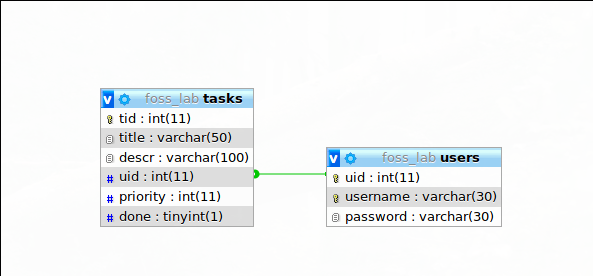

Introduction
============

LAMP is an archetypal model of web service stacks, named as an acronym
of the names of its original four open-source components: the Linux
operating system, the Apache HTTP Server, the MySQL relational database
management system (RDBMS), and the PHP programming language. The LAMP
components are largely interchangeable and not limited to the original
selection. As a solution stack, LAMP is suitable for building dynamic
web sites and web applications.

It is called a stack because each layer derives off its base layers.
Linux, the OS forms the base layers. Apache, the web daemon, sits on top
of the OS. The database, is hosted by the web daemon. PHP (or any
scripting language) is used to drive and display all the data, and allow
for user interaction.

The code of our project is hosted at
https://github.com/justine05/foss-php

Linux
-----

Linux is a family of open source Unix-like operating systems based on
the Linux kernel, an operating system kernel first released on September
17, 1991 by Linus Torvalds. Linux is typically packaged in a Linux
distribution (or distro for short).

Popular Linux distributions include Debian, Fedora, and Ubuntu.
Commercial distributions include Red Hat Enterprise Linux and SUSE Linux
Enterprise Server. Desktop Linux distributions include a windowing
system such as X11 or Wayland, and a desktop environment such as GNOME
or KDE Plasma. Distributions intended for servers may omit graphics
altogether, and include a solution stack such as LAMP. Because Linux is
freely redistributable, anyone may create a distribution for any
purpose.

Apache HTTP Server
------------------

The role of LAMP's web server has been traditionally supplied by Apache,
and has since included other web servers such as Nginx.

Apache is developed and maintained by an open community of developers
under the auspices of the Apache Software Foundation. Released under the
Apache License, Apache is open-source software. A wide variety of
features are supported, and many of them are implemented as compiled
modules which extend the core functionality of Apache. These can range
from server-side programming language support to authentication schemes.

MySQL
-----

MySQL's original role as the LAMP's relational database management
system (RDBMS) has since been alternately provisioned by other RDBMSs
such as MariaDB or PostgreSQL, or even NoSQL databases such as MongoDB.

MySQL is a multithreaded, multi-user, SQL database management system
(DBMS), acquired by Sun Microsystems in 2008, which was then acquired by
Oracle Corporation in 2010. Since its early years, the MySQL team has
made its source code available under the terms of the GNU General Public
License, as well as under a variety of proprietary agreements.

This application uses MariaDB, a community developed fork of MySQL, led
by its original devs.

PHP
---

PHP's role as the LAMP's application programming language has also been
performed by other languages such as Perl and Python.

PHP is a server-side scripting language designed for web development but
also used as a general-purpose programming language. PHP code is
interpreted by a web server via a PHP processor module, which generates
the resulting web page. PHP commands can optionally be embedded directly
into an HTML source document rather than calling an external file to
process data. It has also evolved to include a command-line interface
capability and can be used in standalone graphical applications.

The Database Schema
===================

The data base schema is as shown below
{width="\\linewidth"}

A user table with the following attributes:

\|2cm\|2cm\|2cm\|2cm\| uid& User ID& int& Primary Key, Auto Increment&
username& Username& varchar(50)& Unique& password& Hash of the password&
varchar(256)&

A tasks table with the following attributes:

\|2cm\|2cm\|2cm\|2cm\| tid& Task ID& int& Primary Key, Auto Increment&
title& Task Title& varchar(50)& & descr& Task Decription& varchar(100)&
& uid& The User ID of the user& int& Foreign Key to users.uid& priority&
Task Priority& int& & done& Whether the task is done& int& &

The database is created using the phpmyadmin. The SQL query used is:

``` {.php tabsize="4" breaklines=""}
    CREATE TABLE users (
            id int(11) NOT NULL AUTO_INCREMENT,
            name varchar(30) NOT NULL,
            password varchar(512) NOT NULL,
            PRIMARY KEY (id),
            UNIQUE (username)
    ) ENGINE=InnoDB DEFAULT CHARSET=utf8mb4;
```

``` {.php tabsize="4"}
    CREATE TABLE tasks (
            tid int(11) NOT NULL AUTO_INCREMENT,
            title varchar(50) NOT NULL,
            descr varchar(100) DEFAULT NULL,
            uid int(11) NOT NULL,
            priority int(11) NOT NULL DEFAULT 3,
            done tinyint(1) NOT NULL DEFAULT 0,
            PRIMARY KEY(tid),
            FOREIGN KEY (uid) REFERENCES users(uid)
    ) ENGINE=InnoDB DEFAULT CHARSET=utf8mb4;
```

The To-Do Application
=====================

Introduction
------------

What we have made is a simple to-do application in which a user can
login to see his/her personalized to-do list.

index.php
---------

This page is the front page of our application. It contains a login form
and a link to the register page.

``` {.php tabsize="4"}
    if (isset($_POST['submit']))
```

This line checks if the user has come to the page after clicking the
Login button. If it is the code checks if the inputs are not empty and
are valid.

If the inputs are valid, it gets the row from the database and verifies
the password, redirecting to the tasks.php page if the username and
password match. If not, the corrosponding errors are printed onto the
page.

``` {.php tabsize="4" breaklines=""}
$dbpass = mysqli_query($db,"SELECT password FROM users WHERE username = '$username' ");
$p = mysqli_fetch_array($dbpass)["password"];
if(empty($p)){
    $error = -1;
}
else if (password_verify($password, $p)){
    $error = 0;
    $_SESSION['username'] = $username;
    header('location: tasks.php');
}
```

register.php
------------

This page is used to register a new user. A register for is present in
the page. This page contains similar code to check if the inputs are
valid and if the user came to the page after clicking the Register
button. Also checks if the password and the reentered password are the
same. It also checks if the username already exists in the database. If
everything is ok, the username and hashed password are inserted into the
database.

The user is then redirected to the login page.

tasks.php
---------

It is the page that the user is redirected to after successful login.
Here the user can veiw and add tasks to his personalized to-do list.
Each task has a title, optional desription and a priority(default 3).
The task can be marked as done. A task marked as done will have
different CSS.

There is also an option to cleared tasks from the list. It display the
same page after a redirect via drop.php

Clicking the logout button, redirects the user to the login page,
index.php, via a logout.php file.

logout.php
----------

This file clears the session and redirects to index.php file.

drop.php
--------

This file runs a query to drop all the tasks for the current user that
are done.

Conclusion
==========

We were able to successfully create a login page using php. First of
all, we learnt the basics of PHP, SQL and HTML, we could complete the
login page within 1 day. This project has helped us improve our
knowledge of php and sql. We sincerely thank our teachers to give us an
opportunity to form groups and complete the project as we could share
our ideas and have a fruitful discussions!

References
==========

1.  digitalocean.com

2.  stackoverflow.com

3.  w3schools.com
